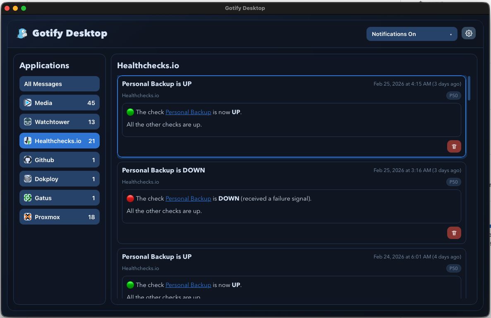
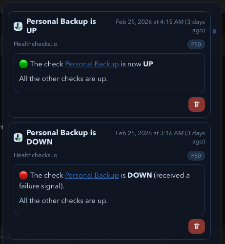

# Gotify Desktop (macOS)

Gotify Desktop is a native macOS client for [Gotify](https://gotify.net/), built with Tauri (Rust) + React.

## Features

- Real-time stream of Gotify messages over websocket
- App-filtered message list with unread-style grouping
- Native macOS desktop notifications
- Quick controls for notification pause/resume
- Local desktop experience for self-hosted Gotify instances

## Screenshots





## Installation

Download the latest release from GitHub and move `Gotify Desktop.app` to `/Applications`.

## Opening downloaded builds on macOS (Gatekeeper)

If macOS says `"Gotify Desktop.app" is damaged and can't be opened`, Gatekeeper is blocking an unsigned or unnotarized app.

Try these options:

- In Finder, right-click `Gotify Desktop.app` and choose `Open`.
- Check `System Settings -> Privacy & Security` for an `Open Anyway` button after a failed launch attempt.

If the app is still blocked, remove the quarantine attribute:

```bash
xattr -dr com.apple.quarantine "/Applications/Gotify Desktop.app"
```

Notes:
- This is usually required per downloaded build (new downloads are quarantined again).
- For smooth install/launch without bypass steps, releases must be signed and notarized with an Apple Developer account.

## Development and release docs

For local development, build, logs, and release workflow, see [`DEVELOPMENT.md`](DEVELOPMENT.md).
